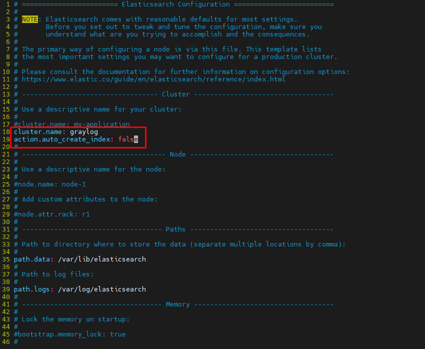
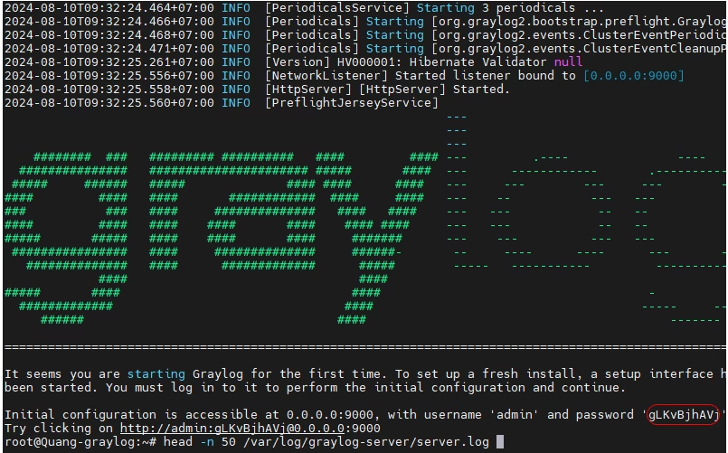

- [Hướng dẫn cài đặt Gray Log 5.x trên Ubuntu 22.04](#hướng-dẫn-cài-đặt-gray-log-5x-trên-ubuntu-2204)
  - [1. Yêu cầu tiên quyết](#1-yêu-cầu-tiên-quyết)
  - [2. Chi tiết cài đặt](#2-chi-tiết-cài-đặt)
    - [2.1 Update the local package index](#21-update-the-local-package-index)
    - [2.2 Cài đặt OpenJDK](#22-cài-đặt-openjdk)
    - [2.3 Cài đặt ElasticSearch](#23-cài-đặt-elasticsearch)
    - [2.4 Cài đtawj MongoDB](#24-cài-đtawj-mongodb)
    - [2.5 Cài đặt máy chủ Graylog](#25-cài-đặt-máy-chủ-graylog)
    - [2.6 Nginx và seft certificates](#26-nginx-và-seft-certificates)
  - [3. Một số lưu ý](#3-một-số-lưu-ý)
- [Tài liệu tham khảo](#tài-liệu-tham-khảo)
# Hướng dẫn cài đặt Gray Log 5.x trên Ubuntu 22.04
## 1. Yêu cầu tiên quyết
- Yêu cầu về hệ thống
  - HĐH : Ubuntu 22.04
  - RAM : Tối thiểu 4GB RAM cho môi trường LAB và 8GB RAM cho môi trường thực tế
  - CPU : Tối thiểu 2 CPU cho môi trường LAB và 4 CPU cho môi trường thực tế
  - DISK : Tối thiểu 10GB
- Yêu cầu phần mềm
  - Java: Graylog yêu cầu Java 8 hoặc Java 11. Hãy đảm bảo cài đặt OpenJDK hoặc Oracle JDK. OpenJDK 17 (Cái này được nhúng trong Graylog và không cần cài đặt riêng.)
  - Elasticsearch: Graylog sử dụng Elasticsearch để lập chỉ mục và tìm kiếm dữ liệu log. Elasticsearch 7.x là phiên bản được khuyến nghị.
  - MongoDB: Graylog sử dụng MongoDB để lưu trữ cấu hình và metadata. MongoDB 5.x hoặc 6.x
- Yêu cầu firewall
  - Cổng 9000: Để truy cập vào giao diện web của Graylog
  - Cổng 9200 và 9300: Để Elasticsearch hoạt động.
  - Cổng 27017: Để MongoDB hoạt động.
## 2. Chi tiết cài đặt
### 2.1 Update the local package index
- Đầu tiên ta cần cập nhật các gói để tránh xung đột khi cài đặt 
  ```
  sudo apt update
  ```
- Tiếp theo cài đặt các gói phụ thưộc cần thiết trong quá trình cài đặt máy chủ gray log
  ```
  sudo apt install curl wget apt-transport-https
  ```
### 2.2 Cài đặt OpenJDK
- Trước khi cài đặt Graylog chúng ta cần cài đặt Java. Chúng ta sẽ cài đặt OpenJDK một triển khai Java mã nguồn mở và miễn phí hiện đang được Oracle duy trì. Gray log 5.2 yêu cầu ít nhất OpenJDK 17
- Để cài đặt OpenJDK 17, hãy chạy lệnh:
  ```
  sudo apt install openjdk-17-jre-headless -y
  ```
- Sau khi cài đặt, bạn có thể xác nhận phiên bản Java đã cài đặt 
  ```
  java -version
  ```
  
### 2.3 Cài đặt ElasticSearch
Trong Graylog, Elaticsearch lưu trữ, tìm kiếm và phân tích nhật ký cũng như tin nhắn từ các nguồn bên ngoài.

- Elaticsearch không được lưu trữ trên kho chính thức của Ubuntu. Do đó, chúng tôi sẽ cài đặt nó từ kho lưu trữ Elaticsearch. Để làm như vậy, trước tiên, hãy tải xuống và thêm Khóa GPG của Elaticsearch.
  ```
  curl -fsSL https://artifacts.elastic.co/GPG-KEY-elasticsearch | sudo apt-key add -
  ```
  ```
  root@Quang-Graylog:~# curl -fsSL https://artifacts.elastic.co/GPG-KEY-elasticsearch | sudo apt-key add -
  Warning: apt-key is deprecated. Manage keyring files in trusted.gpg.d instead (see apt-key(8)).
  OK
  ```
-  chuyển sang người dùng root.
  ```
  sudo su -
  ```
- Và thêm kho lưu trữ Elaticsearch vào hệ thống.
  ```
  echo "deb https://artifacts.elastic.co/packages/7.x/apt stable main" | sudo tee -a /etc/apt/sources.list.d/elastic-7.x.list
  ```
- Cập nhật lại kho lưu trữ mới thêm vào
  ```
  apt update
  ```
- Bây giờ ta có thể cài đặt Elaticsearch bằng apt rồi
  ```
  apt install elasticsearch -y
  ```
- Sau khi cài đặt hoàn tất bạn cần chỉnh sửa lại file cấu hình chính
  ```
  vi /etc/elasticsearch/elasticsearch.yml
  ```
  Thêm vào nội dung sau:
  ```
  cluster.name: graylog
  action.auto_create_index: false
  ```
  
- Để lưu những that đổi ta cần tải lại systemd
  ```
  systemctl daemon-reload
  systemctl start elasticsearch
  systemctl enable elasticsearch 
  ```
- Kiểm tra lại trạng thái elasticsearch
  ```
  systemctl status elasticsearch
  ```
  
- Bạn có thể sử dụng lệnh curl gửi yêu cầu GET để xem thồn tin chi tiết về Elaticsearch
  ```
  curl -X GET http://localhost:9200
  ```
  

### 2.4 Cài đtawj MongoDB
Trong máy chủ Graylog, cơ sở dữ liệu MongoDB lưu trữ thông tin cấu hình và dữ liệu người dùng. Phiên bản mới nhất của Graylog yêu cầu bản phát hành MongoDB 5.x và 6.x. Đối với hướng dẫn này, chúng tôi sẽ cài đặt MongoDB 6.0 từ kho lưu trữ MongoDB

- thêm khóa ký GPG MongoDB.
  ```
  curl -fsSL https://pgp.mongodb.com/server-6.0.asc | \
  sudo gpg --dearmor -o /etc/apt/trusted.gpg.d/mongodb-server-6.0.gpg
  ```
- thêm kho lưu trữ MongoDB vào sources.list.dthư mục trên hệ thống
  ```
  echo "deb [ arch=amd64,arm64 signed=/etc/apt/trusted.gpg.d/keyrings/mongodb-server-6.0.gpg ] https://repo.mongodb.org/apt/ubuntu jammy/mongodb-org/6.0 multiverse" | sudo tee /etc/apt/sources.list.d/mongodb-org-6.0.list
  ```
- Cập nhật lại kho lưu trữ
  ```
  apt update
  ```
-  cài đặt máy chủ cơ sở dữ liệu MongoDB.
  ```
  apt install mongodb-org -y
  ```
  - Mặc đình thì khi cài đặt xong thì MongoDB sẽ tạo ra 1 user và group mới tên `mongodb`
  
- Để xác minh phiên bản đã cài đặt, hãy chạy lệnh:
  ```
  mongod --version
  ```
- Ta tiến hành bật mongodb-org
  ```
  systemctl start mongod
  systemctl enable mongod
  systemctl status mongod
  ```
  
### 2.5 Cài đặt máy chủ Graylog
Theo mặc định, gói máy chủ Graylog không có sẵn trên kho Ubuntu. Do đó, chúng tôi sẽ cài đặt Graylog từ kho Graylog chính thức.

- tải xuống gói Graylog Debian.
  ```
  wget https://packages.graylog2.org/repo/packages/graylog-5.2-repository_latest.deb
  ```
- chạy lệnh dpkg để chạy gói.
  ```
  dpkg -i graylog-5.2-repository_latest.deb
  ```
- Update lại apt
  ```
  apt-get update
  ```
- Cài đặt lại Gray log Server
  ```
  apt install graylog-server -y
  ```
- Khi bạn đã cài đặt máy chủ Graylog, bạn cần tạo một bí mật để bảo mật mật khẩu người dùng và mật khẩu được mã hóa cho người dùng quản trị viên.Để tạo mật khẩu bí mật để bảo mật mật khẩu người dùng, hãy chạy lệnh sau:
  ```
  < /dev/urandom tr -dc A-Z-a-z-0-9 | head -c${1:-96};echo;
  ```
- Tiếp theo, tạo mật khẩu được mã hóa cho người dùng đăng nhập quản trị viên Graylog
  ```
  echo -n "Enter Password: " && head -1 </dev/stdin | tr -d '\n' | sha256sum | cut -d" " -f1
  ```

- Sao chép và dán hai mật khẩu được mã hóa vào đâu đó và mở tệp cấu hình Graylog.
  ```
  vi /etc/graylog/server/server.conf
  ```
  ```
  password_secret = hTRdp0JxNLeuxKXFeTjNYzOMpM-6zdBPalK4eKbsEhxSlxkIFgTcUBzPmhj21Hc89OmyW1NqitmROHXtgqJqwGte4t7PBwi0

  root_password_sha2 = bfe4814665ab5c23359f7114d289110e7c725a1528fa2cd68c601a0a5d6c05108
  ```
  
  - chỉ định địa chỉ IP mà giao diện Graylog HTTP sẽ lắng nghe bằng tệp http_bind_address
  ```
  http_bind_address = 0.0.0.0:9000
  ```
  - Do bên dưới ta có cấu hình ssl nên cần chuyển `http_publish_uri = http://172.16.66.55:9000/` thành `http_publish_uri = https://172.16.66.55:9000/` để sau khi cài nginx + ssl có thể truy cạp interface trên web
- Dưới đây là toàn bộ nội dung của file cấu hình của tôi
  ```
  root@Quang-Graylog:~# grep -vE '^#|^$' /etc/graylog/server/server.conf
  is_leader = true
  node_id_file = /etc/graylog/server/node-id
  password_secret = 99lR1Edkx9dPFwhMoFjhMgKvqvDHhLgEcQduarwjLnmXp1xnftlcJJPpQJlYbfU9y5Zi76JTU183eYELRnTBC0yr9RiQzPDq
  root_username = admin
  root_password_sha2 = b8fd054ea0d56f5662463a37f53bfe2cf530500df267b7efcde984eb59b2415e
  root_timezone = Asia/Ho_Chi_Minh
  bin_dir = /usr/share/graylog-server/bin
  data_dir = /var/lib/graylog-server
  plugin_dir = /usr/share/graylog-server/plugin
  http_bind_address = 0.0.0.0:9000
  http_publish_uri = http://172.16.66.55:9000/
  stream_aware_field_types=false
  disabled_retention_strategies = none
  allow_leading_wildcard_searches = false
  allow_highlighting = false
  field_value_suggestion_mode = on
  output_batch_size = 500
  output_flush_interval = 1
  output_fault_count_threshold = 5
  output_fault_penalty_seconds = 30
  processbuffer_processors = 5
  outputbuffer_processors = 3
  processor_wait_strategy = blocking
  ring_size = 65536
  inputbuffer_ring_size = 65536
  inputbuffer_processors = 2
  inputbuffer_wait_strategy = blocking
  message_journal_enabled = false
  lb_recognition_period_seconds = 3
  mongodb_uri = mongodb://localhost/graylog
  mongodb_max_connections = 1000
  ```
- Lưu lại cấu hình và load lại dịch vụ
  ```
  systemctl daemon-reload
  systemctl start graylog-server
  systemctl enable graylog-server
  systemctl status graylog-server
  ```

### 2.6 Nginx và seft certificates
- Tải xuống nginx
  ```
  apt install nginx
  ```
- Tạo ra private key với 2048 bit
  ```
  openssl genrsa -out CA.key 2048
  ```
- Tạo ra file xác định danh tính của CA từ private key đã tạo ra từ trước
  ```
  openssl req -x509 -sha256 -new -nodes -days 3650 -key CA.key -out CA.pem
  ```
- Tạo ra private key cho trang web
  ```
  openssl genrsa -out localhost.key 2048
  openssl req -new -key localhost.key -out localhost.csr
  ```
- Tạo ra 1 file chứa thông tin mở rộng của chứng chỉ. Để khi ký chứng chỉ phải tuân theo điều kiện trong file
  ```
  vi localhost.ext
  ```
  Thêm vào nội dung sau
  ```
  authorityKeyIdentifier = keyid,issuer
  basicConstraints = CA:FALSE
  keyUsage = digitalSignature, nonRepudiation, keyEncipherment, dataEncipherment
  subjectAltName = @alt_names
  [alt_names]
  DNS.1 = graylog.thanhquang.local
  IP.1 = 172.16.66.55
  ```
- Dùng chứng chỉ CA ký cho chứng chỉ của trang web ta đã tạo và tạo ra file chứa chứng chỉ đã ký
  ```
  openssl x509 -req -in localhost.csr -CA CA.pem -CAkey CA.key -CAcreateserial -days 365 -sha256 -extfile localhost.ext -out localhost.crt
  ```
- Tạo ra thư mục lưu trữ các chứng chỉ để nginx sử dung
  ```
  mkdir /etc/nginx/ssl-certificate
  mv localhost.crt localhost.key /etc/nginx/ssl-certificate
  ```
- Tạo file cấu hình nginx cho gray log
  ```
  vi /etc/nginx/sites-available/graylog.conf
  ```
- Thêm vào nội dung sau
    ```
    server {
            listen 80;
            listen [::]:80;
            server_name 172.16.66.55;
            return 301 https://$host$request_uri;
    }

    server {
            listen 443 ssl;
            listen [::]:443 ssl;
            server_name 172.16.66.55;
            # root /var/www/html;
            index index.html index.htm index.nginx-debian.html;
            # SSL Configuration
            ssl_certificate     /etc/nginx/ssl-certificate/localhost.crt;
                    ssl_certificate_key /etc/nginx/ssl-certificate/localhost.key;
            # Logs Locations
            access_log  /var/log/nginx/graylog_access.log;
            error_log  /var/log/nginx/graylog_error.log;
            location / {
                        proxy_set_header Host $http_host;
                        proxy_set_header X-Forwarded-Host $host;
                        proxy_set_header X-Forwarded-Server $host;
                        proxy_set_header X-Forwarded-For $proxy_add_x_forwarded_for;
                        proxy_set_header X-Graylog-Server-URL https://$server_name/;
                        proxy_pass       http://127.0.0.1:9000;
            }
    }
    ```
- Tạo symlink để file cấu hình mới sửa có thể được áp dụng
  ```
  ln -s /etc/nginx/sites-available/graylog.conf /etc/nginx/sites-enabled/
  ```
- Khởi động dịch vụ nginx
  ```
  systemctl start nginx
  systemctl restart nginx
  systemctl enable nginx
  ```
- Bây giờ ta đã có thể tiến hành truy cập vào graylog thông qua trình duyệt `https://graylog.thanhquang.local`
  

Lưu ý rằng nếu lần đầu mà bạn đăng nhập thì có thể gặp tình trạng graylog yêu cầu mật khẩu đăng nhập lần đầu tiên chứ không phải mật khẩu admin mà bạn đã thiết lập từ trước


Password này ta có thể tìm thấy ở file /var/log/graylog-server/server.log

```
head -n 50 /var/log/graylog-server/server.log
```



## 3. Một số lưu ý 
- Ta không thể đổi mật khẩu của user admin bằng GUI , ta chỉ có thể đổi trực tiếp bằng file cấu hình server.conf
- Nếu khi bạn đổi pass có thể gặp trường hợp như này hãy disable `message_journal_enabled`
   
   
  
# Tài liệu tham khảo
https://go2docs.graylog.org/5-2/downloading_and_installing_graylog/ubuntu_installation.html

https://www.howtoforge.com/how-to-install-graylog-4-on-ubuntu-22-04/

https://www.cherryservers.com/blog/graylog-install-ubuntu