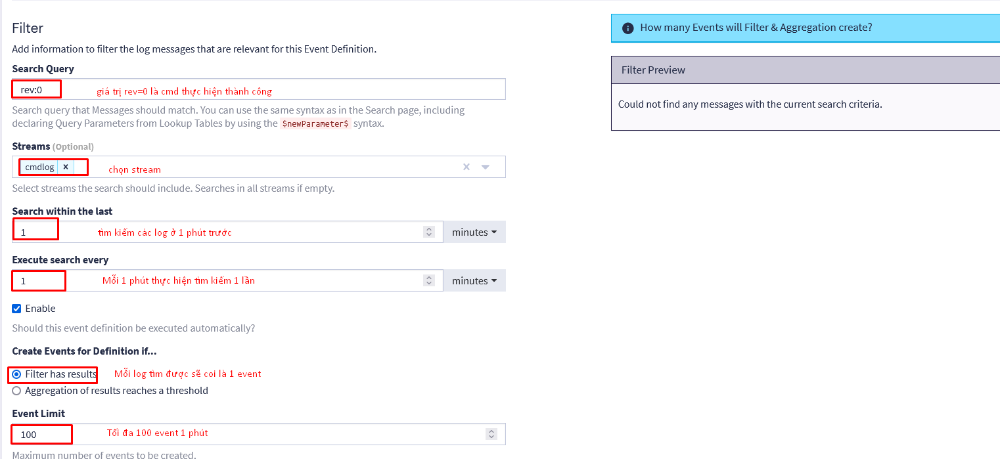

- [Giải thích chi tiết các thông số cụ thể trong Event Definition](#giải-thích-chi-tiết-các-thông-số-cụ-thể-trong-event-definition)
  - [1. Event Details](#1-event-details)
  - [2. Event Condition](#2-event-condition)
  - [3. Notifications](#3-notifications)
  - [4. Ví dụ](#4-ví-dụ)
    - [4.1 Bài toán 1](#41-bài-toán-1)
    - [4.2 Bài toán 2](#42-bài-toán-2)
    - [4.3 Test kết quả Search within the last và Execute search every khi lệch nhau](#43-test-kết-quả-search-within-the-last-và-execute-search-every-khi-lệch-nhau)
# Giải thích chi tiết các thông số cụ thể trong Event Definition
Đây là các bản test với graylog `Graylog 6.0.5+3ef5be7` và plugin telegram :`graylog-plugin-telegram-notification-2.5.0.jar`

## 1. Event Details

Event Details: ghi lại những mô tả cơ bản về Event Definition
- Title: Tên Event Definition
- Description: ghi lại mô tả về event
- Remediation Steps: Các bước sử lý đi kèm khi gặp cảnh báo này

## 2. Event Condition
Event Condition ghi lại điều kiện xảy ra cảnh báo này. Khi có log phù hợp với điều kiện của Event Condition thì cảnh báo sẽ hoạt động

- Condition Type: Chỉ có duy nhất 1 loại điều kiện là Filter & Aggregation là lọc kèm điều kiện
- Search Query: Ta sẽ chỉ định các log message phải có các biến và các biến phải có điều kiện phù hợp. Kèm theo đó ta có thể kết hợp các [biểu thức logic](https://go2docs.graylog.org/5-2/making_sense_of_your_log_data/writing_search_queries.html?TocPath=Searching%20Your%20Log%20Data%7C_____1) như AND, OR, NOT, ? và * ... 
- Streams: Chỉ định các stream được phép tìm kiếm
- Search within the last: Chỉ định mốc thời gian tìm kiếm từ lúc tìm kiếm tở về trước (ví dụ tìm kiếm log của 2 phút trước)
- Execute search every: chỉ định tìm kiếm cứ sau bao nhiêu giây thì có thể lặp lại

- Filter has results: Khi bạn chọn tùy chọn này graylog sẽ thực hiện tạo event chỉ cần khi tìm kiếm được các biến có giá trị đúng với khai báo
- Aggregation of results reaches a threshold: Khi chọn tùy chọn này, Graylog sẽ tạo sự kiện chỉ khi số lượng bản ghi log khớp với bộ lọc đạt đến ngưỡng cụ thể. Ví dụ như phải có 2 lần biến được xuất hiện
  - Group by Field(s): Đây là tùy chọn để ta nhóm các biến thành 1 nhóm. Ví dụ như Nếu bạn cấu hình nhóm theo username, và mỗi tài khoản có hơn 5 lần đăng nhập thất bại, Graylog sẽ gửi một cảnh báo cho mỗi username. Lưu ý không nhóm các biến dùng với các hàm count, avg,... vì khi nhóm như thế thì hàm count sẽ tính thành 1 kể cả khi đã có 3 message thỏa mãn
  - Create Events for Definition
    - meessage phải thỏa mãn đủ toàn bộ các điều kiện hoặc 1 trong các điều kiện (all/any)
    - Nó cũng cung cấp cho ta các hàm để sử dụng ví dụ như count, sum,... dùng để đếm số lần biến nào đó xuất hiện vượt quá hay nhỏ hơn thông số ta quy định.
  
- Lưu ý rằng khi chọn Filter has results thì sẽ có thêm Event Limit: Giới hạn số sự kiện tối đa được tạo ra trong khoảng thời gian ta chỉ định như ở trên là tối đa 100 event trong vòng 1 phút

  

## 3. Notifications

- add Notification: Ta chọn loại nội dung cảnh báo gửi đi. Nội dung này đã được thiết lập từ trước. Ví dụ như nội dung ta đã soạn sẵn để gửi đến telegram khi có cảnh báo như thế
- Grace Period: Thời gian trì hoãn giữa các cảnh báo được gửi đi. Ví dụ trong 1 phút search thấy có 5 message thỏa mãn điều kiện cảnh báo thì sẽ gửi các tin nhắn cách nhau 5 giây
- Message Backlog: Mỗi cảnh báo sẽ được coi là 1 thông tin. Message Backlog cho phép gộp bao nhiêu thông tin vào 1 lần để gửi đi. Ví dụ ta có 5 cảnh báo thỏa mãn và ta đặt Message Backlog=1 thì cứ 1 cảnh báo sẽ được gửi 1 lần và gửi 5 lần 
## 4. Ví dụ
### 4.1 Bài toán 1
Tôi muốn tìm các message có cmd log thực hiện thành công và gửi mỗi message bằng 1 tin nhắn đến telegram. Mỗi 1 phút tìm kiếm 1 lần và tìm kiếm ở 1 phút trước, tối đa 100 event được tìm thấy trong vòng 1 phút

Kết quả

### 4.2 Bài toán 2
Tôi muốn tìm kiếm xem trong vòng 1 phút có bao nhiêu tin cmd log được thực hiện thành công và gửi đi 5 cảnh báo cuối cùng đến telegram (không tạo group)

Kết quả:

### 4.3 Test kết quả Search within the last và Execute search every khi lệch nhau

Bây giờ tôi muốn test kết quả mỗi 1 phút tìm kiếm 1 lần và tìm kiếm log của 4 phút trước

Như vậy nó chỉ gửi về đúng message mới và chưa được xử lý từ trước thôi