- [Bài thực hành cấu hình stream và index set trên Graylog](#bài-thực-hành-cấu-hình-stream-và-index-set-trên-graylog)
  - [1. Mô hình triển khai](#1-mô-hình-triển-khai)
  - [2. Mô tả quá trình](#2-mô-tả-quá-trình)
  - [3. Thực hành](#3-thực-hành)
    - [3.1 Tạo Index Set và sửa lại Index set default](#31-tạo-index-set-và-sửa-lại-index-set-default)
    - [3.2 Tạo Grok Patern và Stream](#32-tạo-grok-patern-và-stream)
      - [3.2.1 Tạo Grok Patern và Stream Secure](#321-tạo-grok-patern-và-stream-secure)
    - [3.2.2 Tạo Grok Patern và Stream VM](#322-tạo-grok-patern-và-stream-vm)
    - [3.2.3 Tạo Grok Paterm và Stream Permission](#323-tạo-grok-paterm-và-stream-permission)
# Практичне завдання з налаштування потоків (streams) та наборів індексів (index sets) у Graylog
## 1. Модель розгортання
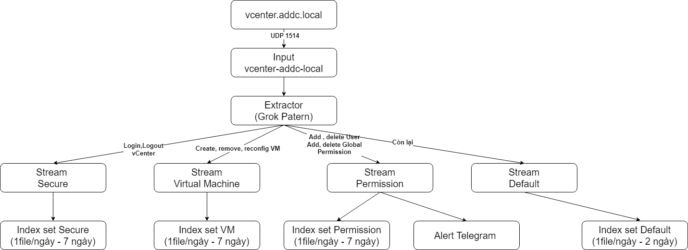
## 2. Опис процесу
- Спочатку ми налаштуємо Input, щоб отримувати логи з vCenter (vcenter.addc.local) через UDP/1514 (це було зроблено в попередньому завданні).
- Далі потрібно створити 3 Index Set для зберігання інформації логів, які відповідатимуть 3 потокам (Streams), та змінити налаштування Index Set default згідно з параметрами на зображенні.
- Коли ми отримуємо повідомлення від vCenter, ми використовуватимемо Grok Pattern, щоб структурувати повідомлення, потім відфільтрувати відповідні змінні action та перенаправити їх у відповідний потік (Stream).
- На завершення, потрібно налаштувати сповіщення в Telegram, яке буде надсилатися щоразу, коли потік Permission отримує лог.
## 3. Практика
### 3.1 Створення Index Set та зміна налаштувань Index Set за замовчуванням
- Створіть 3 Index Set та назвіть їх відповідно до потоків (streams).
  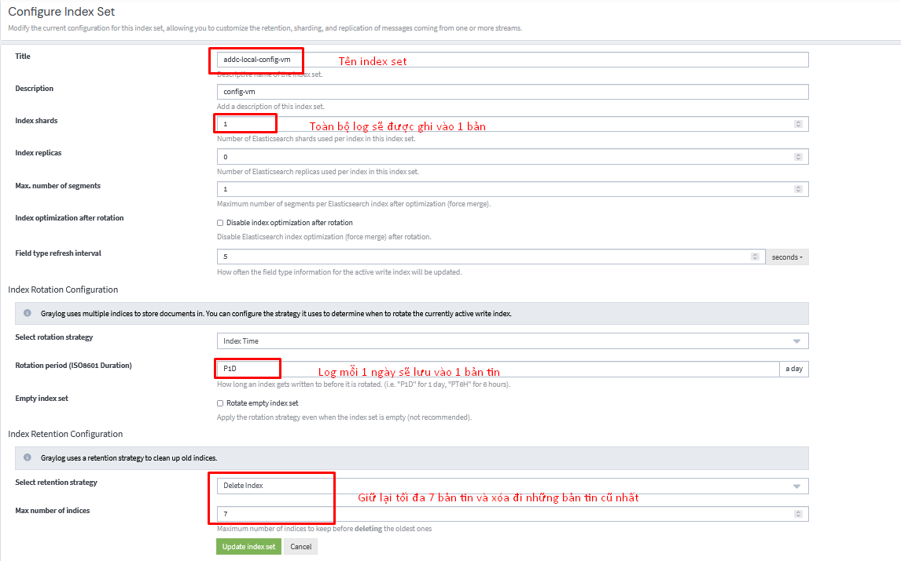
- Аналогічно зробіть для двох інших Index Set.
- Далі необхідно змінити налаштування Index Set за замовчуванням.
  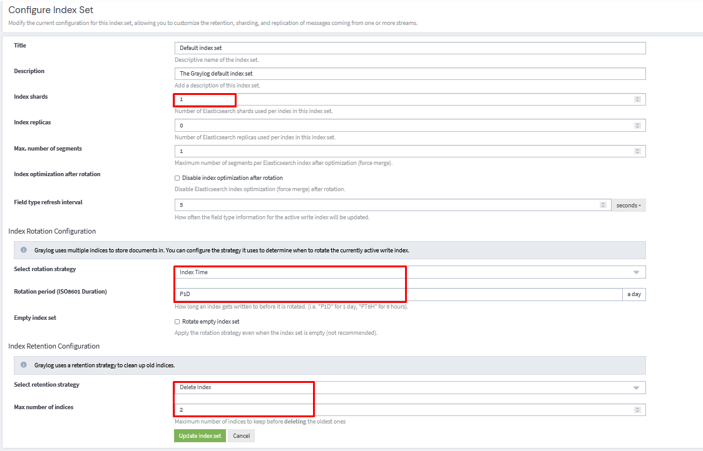
- Результат
  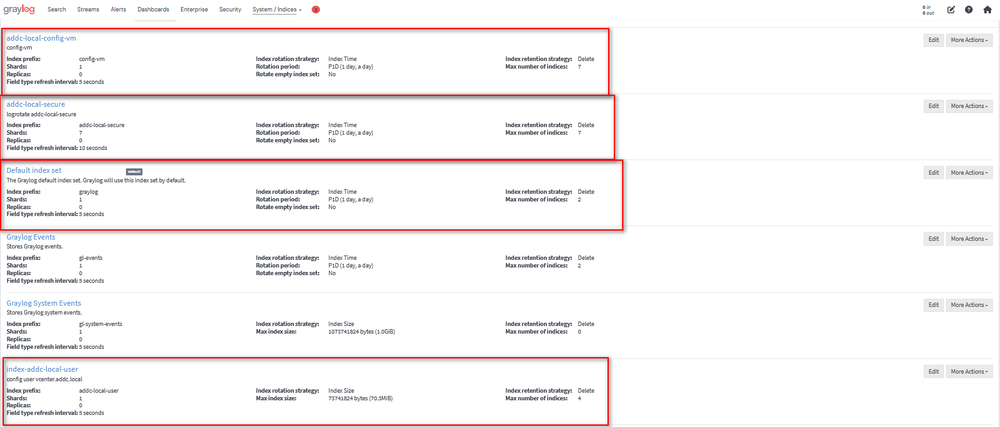
### 3.2 Створення Grok Pattern та Stream (потоку)
#### 3.2.1 Створення Grok Pattern та Stream Secure (потік Secure)
За замовчуванням, при вході до vCenter необхідно авторизуватися через SSO (користувачі, створені за замовчуванням під час налаштування vCenter, не потребують авторизації через SSO). Тому, якщо потрібно відфільтрувати логи входу, слід враховувати лише ті записи, які містять SSO.
- Структура шаблону при вході або виході з vCenter буде однаковою, тому я створю один загальний шаблон Grok Pattern.
  ```
  Event \[%{NUMBER}\] \[1-1] \[%{TIMESTAMP_ISO8601:time}\] \[vim.event.EventEx] \[%{LOGLEVEL:lever}] \[%{DATA:user_login}] \[] \[%{NUMBER}] \[%{GREEDYDATA:action} %{DATA} from %{IPV4:ip} at %{MONTHNUM}/%{MONTHDAY}/%{YEAR} %{HOUR}:%{MINUTE}:%{SECOND} %{WORD} in SSO
  ```
  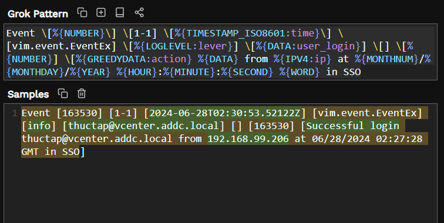
  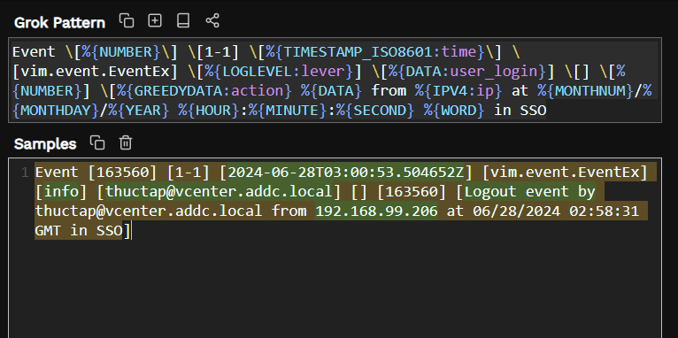

- Tiếp theo ta cần log ssh vào vcenter
  - SSH thành công
  ```
  %{GREEDYDATA:action} for %{WORD:user} from %{IPV4:ip} port %{NUMBER:port} ssh2
  ```
  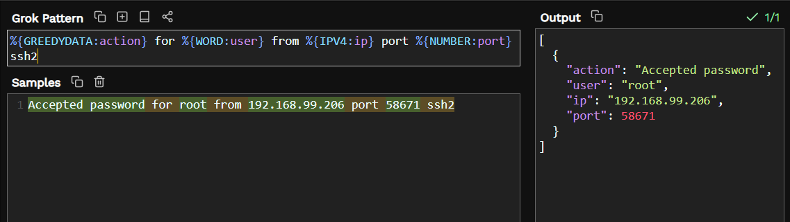
  - Disconnect SSH
  ```
  %{WORD:action} from user %{WORD:user} %{IPV4:ip} port %{NUMBER:port}
  ```
  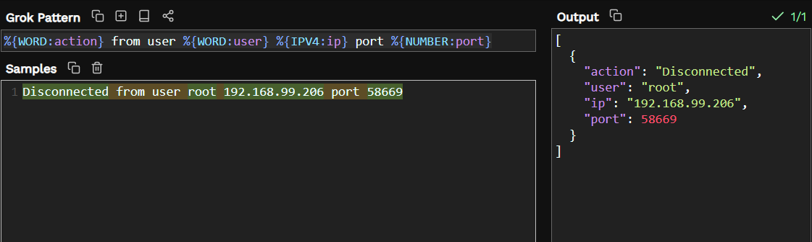
- Chúng ta mới chỉ có log đăng nhập vào VCSA cũng cần có log đăng nhập vào VAMI (port 5480) nữa. Khi bạn đăng nhập vào VAMI (vSphere Appliance Management Interface), bạn không cần sử dụng Single Sign-On (SSO) như khi đăng nhập vào vCenter Server. Thay vào đó, bạn sẽ cần sử dụng tài khoản quản trị của vCenter Server Appliance (VCSA)
  ```
  %{TIMESTAMP_ISO8601:time}: %{LOGLEVEL:lever} Session Authentication request for user : %{DATA:user}. Status : %{WORD:action_vami}
  ```
  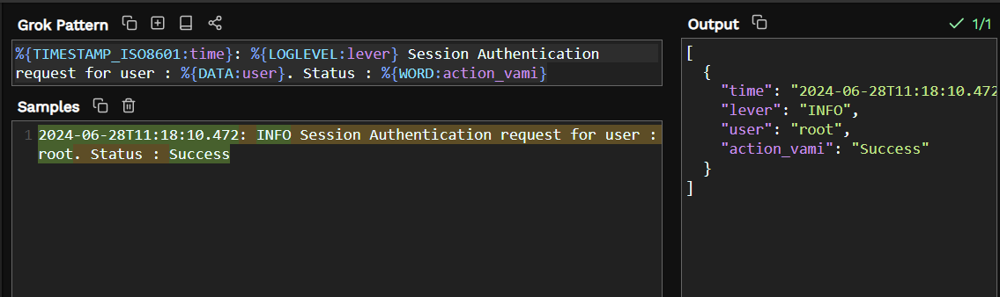
- Log đăng xuất VAMI
  ```
  %{TIMESTAMP_ISO8601:time} %{LOGLEVEL:lever} Operation:status %{DATA} %{DATA:user} %{GREEDYDATA:action_vami}
  ```
  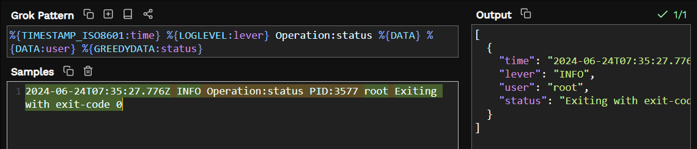
- Bây giờ ta cần tạo Stream để phân loại các luồng
  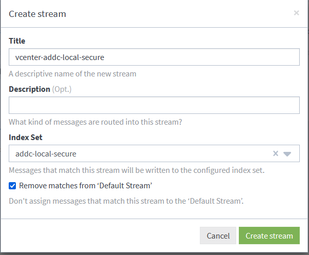
- Tạo ra các rule để quản lý stream đó
  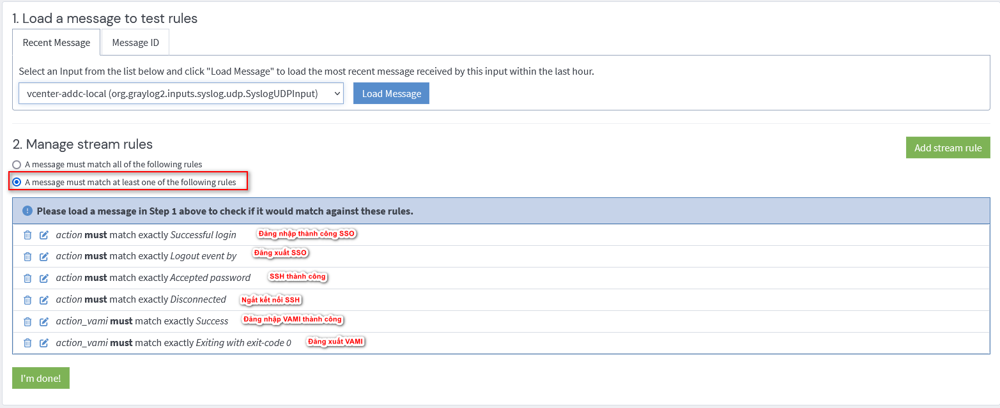

### 3.2.2 Tạo Grok Patern và Stream VM
Nói về thao tác với máy ảo sẽ có 4 trường hợp bật, tắt, restart và reconfig máy ảo
- Log bật máy ảo
  ```
  Event \[%{NUMBER}\] %{DATA} \[%{TIMESTAMP_ISO8601:time}\] \[vim.event.VmPoweredOnEvent] \[%{LOGLEVEL:lever}\] \[%{DATA:user}\]%{GREEDYDATA}\[%{DATA:name_VM} on %{DATA:host} in %{DATA:datastore} has %{GREEDYDATA:state}]
  ```
  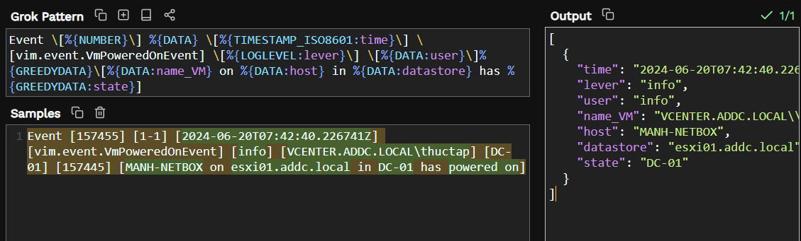
- Log tắt máy ảo
  ```
  Event \[%{NUMBER}\] %{DATA} \[%{TIMESTAMP_ISO8601:time}\] \[vim.event.VmPoweredOffEvent] \[%{LOGLEVEL}\] %{GREEDYDATA} \[%{DATA:name_VM} on  %{DATA:host} in %{DATA:cluster} is %{GREEDYDATA:state}\]
  ```
  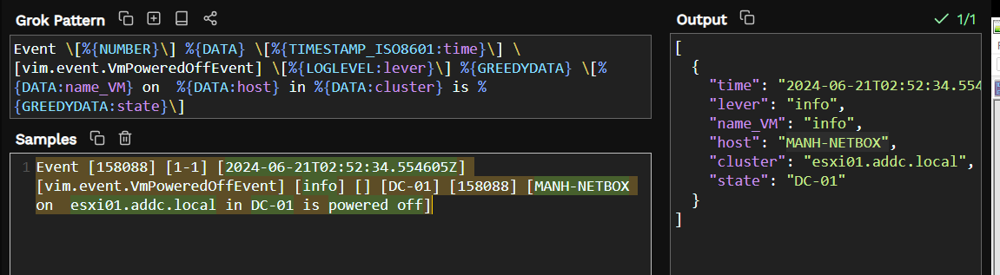
- Log reconfig máy ảo
  ```
  Event \[%{NUMBER}] \[%{DATA}\] \[%{TIMESTAMP_ISO8601:time}] \[vim.event.VmReconfiguredEvent] \[%{LOGLEVEL}] \[%{DATA:user}] %{GREEDYDATA}\[%{DATA:state} %{DATA:name_VM} on %{DATA:host} in %{DATA:datacenter}\. (?s)%{GREEDYDATA:content}\]
  ```
  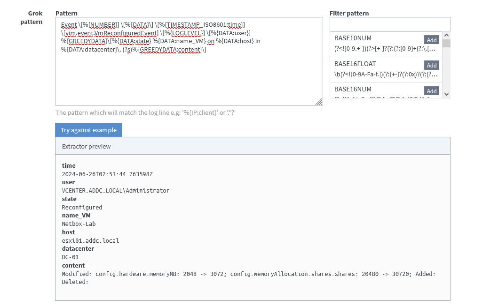
- Bây giờ ta cần tạo ra Stream của VM
  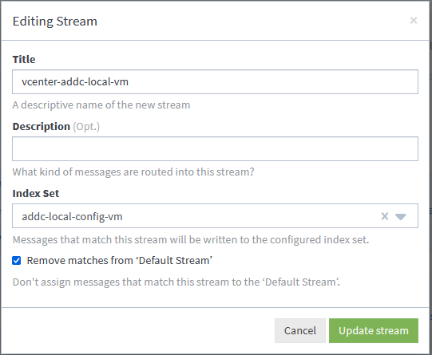
- Tạo các rule để quản lý
  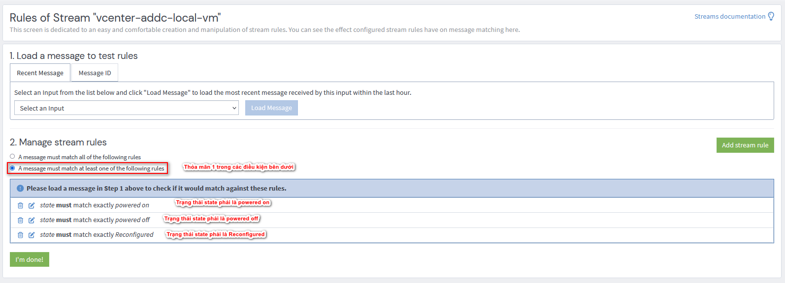

### 3.2.3 Tạo Grok Paterm và Stream Permission
Stream này sẽ lọc ra log của các hành động thêm sửa xóa việc thêm sửa xóa User trên vCenter, thêm sửa xóa các Global Permissions
- Log thêm user
  ```
  %{TIMESTAMP_ISO8601:time} %{LOGLEVEL:lever} ssoAdminServer\[%{GREEDYDATA}\[User \{Name: %{DATA:user_action}, Domain: %{DATA:domain}\} with role \'%{DATA:role}\'] %{GREEDYDATA:action} '%{DATA:user_created}\' with details %{GREEDYDATA:details}
  ```
  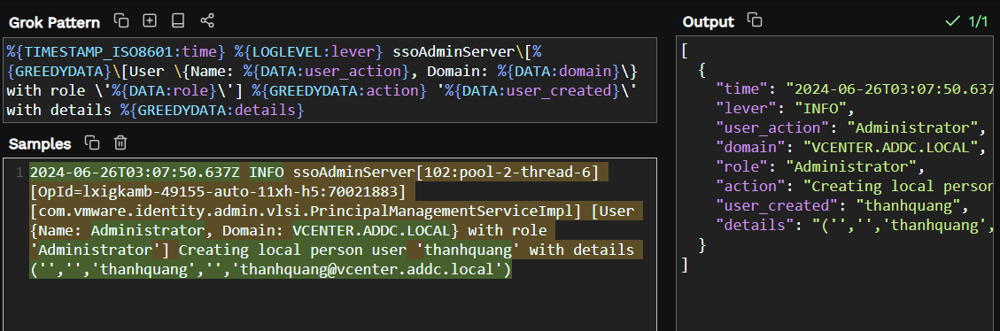
- Log update user
  ```
  %{TIMESTAMP_ISO8601:time} %{LOGLEVEL:lever} ssoAdminServer\[%{GREEDYDATA}\[User \{Name\: %{DATA:user}\, Domain\: %{DATA:domain}\} with role \'%{USERNAME:role}\'] %{DATA:action}\'%{USERNAME:user_action}' details %{GREEDYDATA}
  ```
  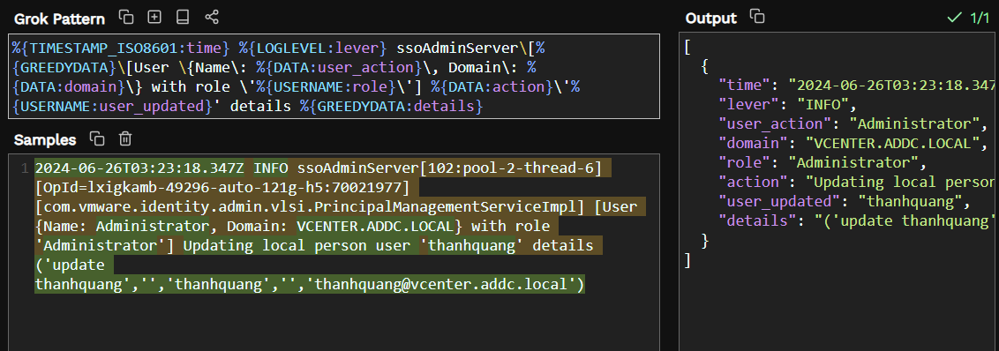

- Log xóa User
  ```
  %{TIMESTAMP_ISO8601:time} %{LOGLEVEL:lever} ssoAdminServer\[%{GREEDYDATA}\[User \{Name\: %{DATA:user}\, Domain\: %{DATA:domain}\} with role \'%{USERNAME:role}\'] %{DATA:action}\'%{USERNAME:user_action}'
  ```
  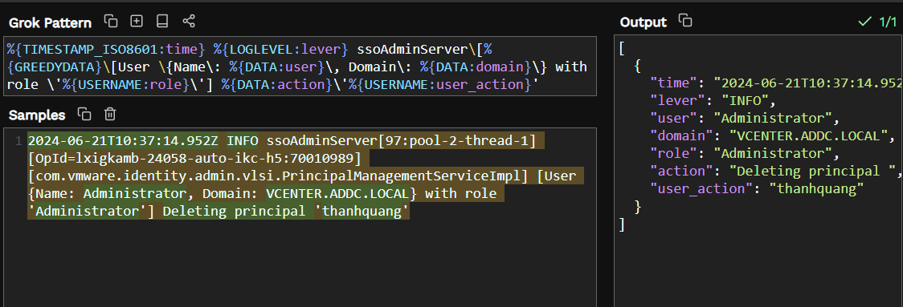

- Log add Global Permission
  ```
  Event \[%{DATA}\] \[%{DATA}\] \[%{TIMESTAMP_ISO8601:time}\] \[vim.event.EventEx\] \[%{LOGLEVEL:lever}\] \[%{DATA:user_action}\] \[] \[%{BASE10NUM}] \[%{DATA:action} for user %{DATA:user_added} with role %{DATA:role} and propagation True\.]
  ```
  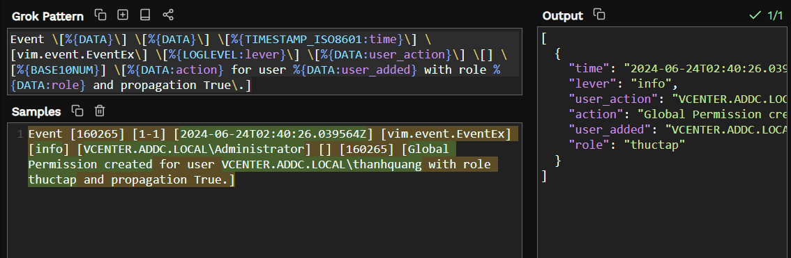

- Log edit Global Permission (Mặc định khi ta thay đổi role của User thì log sẽ hiểu thành tạo một Global Permisssion mới)
  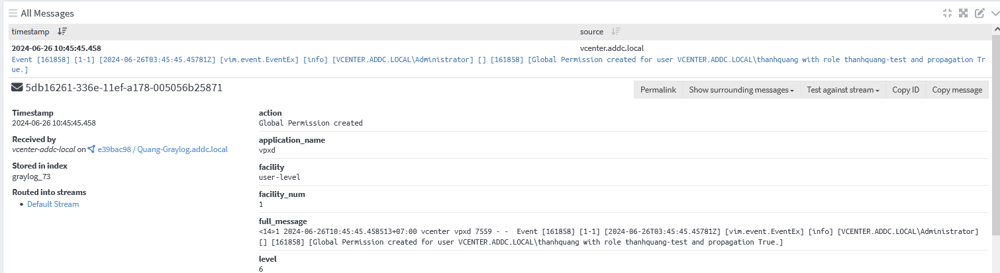
- Log delete Global Permission
  ```
  Event \[%{NUMBER}\] %{DATA}\] \[%{TIMESTAMP_ISO8601:time}\] \[vim.event.EventEx] \[%{LOGLEVEL:lever}\] \[%{DATA:user_action}\] \[] \[%{DATA}\] \[%{DATA:action} for user %{DATA:user_permission}\.]
  ```
  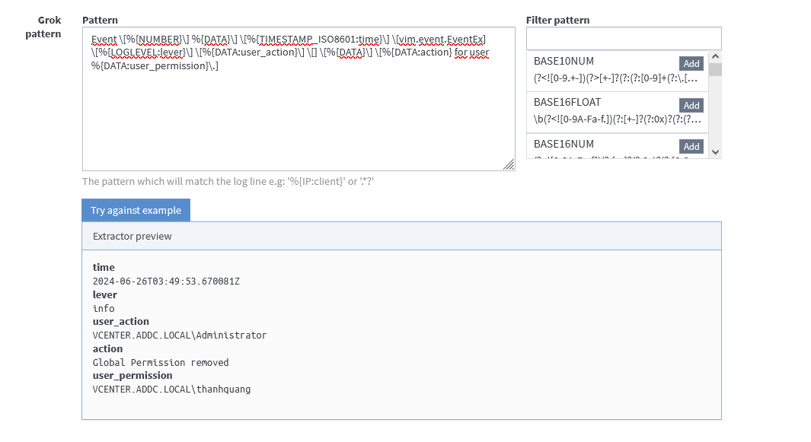
- Log add role
  ```
  Event \[%{NUMBER}] \[%{DATA}\] \[%{TIMESTAMP_ISO8601:time}\] \[vim.event.RoleAddedEvent] \[%{LOGLEVEL:lever}\] \[%{DATA:user_action}\] \[] %{DATA}\] \[New role %{DATA:new_role} %{DATA:action_role}\]
  ```
  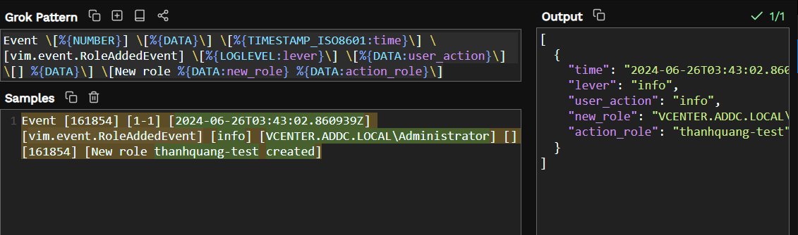
- Log delete role
  ```
  Event \[%{NUMBER}\] \[%{DATA}\] \[%{TIMESTAMP_ISO8601:time}\] \[vim.event.RoleRemovedEvent] \[%{LOGLEVEL:lever}\] \[%{DATA:user_action}\] \[] \[%{NUMBER}\] \[Role %{DATA:role_action} %{DATA:action}\]
  ```
  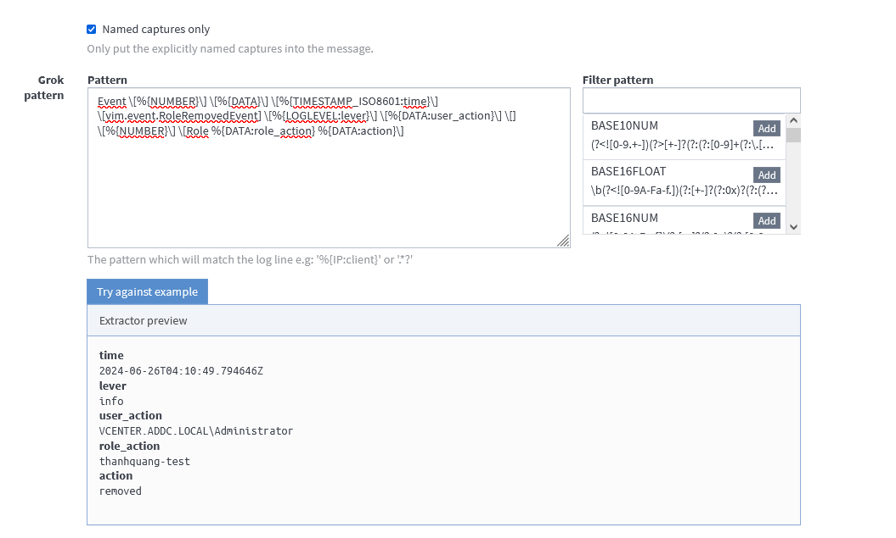

- Kiểm tra kết quả
  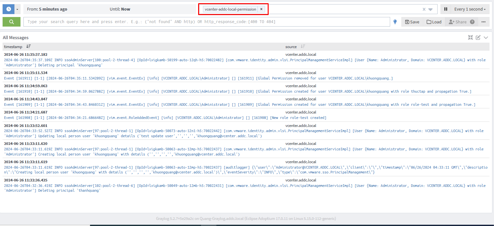

